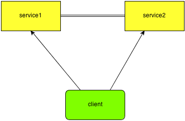
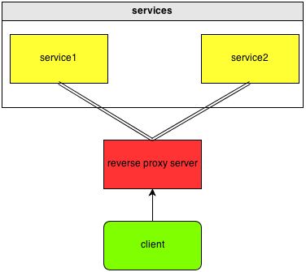
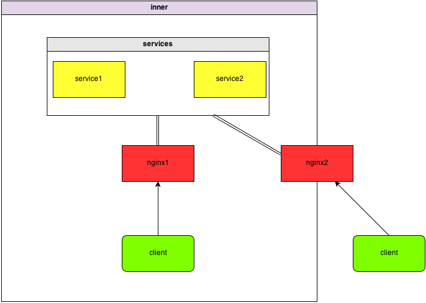

# 介绍

在前一篇"最近关于服务器架构的一点思考"，我主要考虑的是现阶段服务架构的易交互性以及安全性，包括客户端与服务器之间的签名访问，通过access id和security key交互，这套机制虽然简单，但是足够方便与高效。所以，后续碰到了服务器的问题，我也会基于这个原则，简单就好。

因为我们的产品是部署到大型企业内部，供企业内部使用，也就是在内网环境里面，所以在很早期的时候是没考虑企业员工在外网访问的问题的。但是随着部署的企业对这方面的要求越来越高，我们现在不得不考虑我们的服务支持内外网访问，并且要保证足够的安全性。

# http代理服务器

最开始为了快速部署，我提出了一种可行的解决方案，因为我们采用http进行通讯，所以很自然的就可以通过配置一台HTTP代理服务器来解决内外网访问的问题，在外网使用的员工，通过代理服务器访问内部的服务。

这个方案很简单，用户也觉得不错，使用了一段时间之后，一些用户就提意见了。主要有以下两点

- 我在外网使用填写代理地址之后，拿到内网工作，发现无法使用了，因为还是走的外网代理
- 我的企业服务器有内外网地址，我不想用代理方式，你让你们的服务直接部署在有内外网ip的机器上面，这样内外网都能访问

对于第一个问题，我们可以考虑不用解决，因为对于浏览器的使用来说，用户也需要手动去管理自己的代理设置，所以不需要自动处理的。但是对于第二点，直接在具有内外网ip的机器上面部署，则对我们是一个难题了。

# 早期的服务架构

为什么不好解决直接将服务部署到具有内外网ip的机器上面，是因为早期的服务架构导致的，如图：

我们的服务会有多个，并且这些service可能会分布到不同的物理机器上面，但是这些service又是直接对客户端提供服务的，也就是说，如果我们现在需要直接内外功能，那么我们需要将这些service都部署到具有内外网ip的机器上面，假设有10个service，则需要10台这样的机器，这个对于企业是铁定无法接受的。但是如果把这些service都部署到一台内外网ip的机器上面，则服务的性能会大打折扣。

## 一点对架构碎碎念

为什么早期会如此架构，不便考量了，至少优势在于交互简单，快捷方便，但是有如下几个缺点：

- 内外网ip问题，这个在上面已经说明
- service的地址全部对外暴露，client知道的东西太多了
- service之间的地址信息也绑定的太死，不利于动态部署，任何service的变化都需要重启所有相关联的service 

可能还有一些问题，但是我要说的是早期的架构不是不行，在当时，可能它是最好的一套解决方案，只是到了现在，随着需求不断演化，程序的不断复杂，这套架构已经有点不适宜了。所以我认为，**任何的架构方案只是在当时特定的条件下面提出的较好的解决方案**，至于说什么可扩展性，可维护性，我觉得都是逐渐演化的。架构师不是神，不可能预见所有的东西。

所以，对于一个功能，一套架构体系，你拿到手之后立马提一堆问题，说就不应这么设计，然后提出一堆自己认为很好的设计，我只能觉得你这个人不尊重别人的成果，不实事求是，至于其他的评价大家自己去yy吧。

发了一堆的牢骚，只是想说明，没有完美的架构，只有合适的架构。即使我现在设计的这一套方案，没准不久之后我自己又想到了另一套更好的方案也说不定。

# 如何解决？

既然现有的架构不足以解决内外网的问题，那么我们就需要一套新的架构来实现，对于我个人来说，设计新的方案，一般会有如下几点考量：

- 尽量做到架构的演化，而不是推倒重来。以前的东西也有可取的东西，那么我们是可以借鉴的，架构可能跟进化论一样，是不断进化的。而推倒重来，就如同突然基因突变一样，你自认为变好了，没准可能更差。
- 易升级，毕竟我们的程序已经部署到很多企业里面，如何平滑的升级是一个很大的问题，升级就一定要保证数据的完整性。
- 后续面临的问题，这些一定要想清楚，新的架构会面临什么样的情况，性能压力怎样，可扩展性怎样，如果出问题会在什么地方有问题，这些都需要考量。虽然不可能预料到所有情况，但多多益善。
- 简单。架构一定要简单，这算是我一直坚持的原则了，这套体系不光我们能很好明白，对于技术支持人员，运维人员也能很好理解。

那对于现有问题，我们如何解决呢？

## 黑盒！！！

所有的service都在黑盒里面，通过一个统一的代理服务对外提供访问，同时service之间也互相隔离，通过统一的代理服务进行访问。如图：

 

这一套架构，很简单，无非就是引入了一个中间代理层，虽然多了间接层性能上面有损失，但是优势也是显而易见的：

- 地址解耦，配置统一，只有proxy server知道所有service的地址信息，便于集中管理 
- 隔离，service与service之间，service与client之间完全隔离 
- 动态部署，任何service的动态变更，只需要proxy server处理，该service的相关服务完全不用重启，service的扩展方便 

其实说了这么多，都是很简单的机制，在实际中，我们使用nginx作为reverse proxy server。

## 单点故障？

因为所有的service都通过nginx进行交互，大家很容易就想到nginx能不能顶住的问题，也就是单点问题。幸运的是，nginx可以很好的扩展，直接演化出如下架构：

 

而多台nginx的访问则可以通过很多方法，最简单的就是配置dns，或者自己实现一个高效的router服务。

## 内外网访问？

因为我们所有的service都是通过nginx对外提供访问，所以很容易的我们在具有内外网ip的机器上面部署nginx，就能很好的解决内外网访问的问题： 

## comet推送？

我们的service有时候会通过comet通知client进行相应的更新操作，而这些消息无论内网还是外网用户都应该收到，现阶段采用的最简单的做法就是将comet server部署到对外提供访问的nginx那台机器上面，这样内外网用户都能连上comet server，收到通知消息： 

## 文件传输？

因为我们的service会提供存储服务，就面临的一个文件传输的问题，后面以下载为例。当用户上传了一个文件之后，很有可能在短时间内对这个文件感兴趣的人都会去请求将其下载下来。如果整个数据传输通过nginx来中转，那么很有可能造成nginx的性能瓶颈以至于无法处理其他的服务请求。我们通常将服务的请求分为两类，数据请求和逻辑请求，在内网环境下面，服务器如果是百兆网卡，即使每个用户限速一兆，100个用户同时下载也会将服务器网络带宽耗尽，以至于无法处理逻辑请求。虽然这个问题可以通过扩展更多的nginx来解决，但是最好的办法还是客户端直接连接提供下载的service，这样就能做到数据与逻辑的分开处理。

因为我们的file service都是部署在内网，所以内网用户能直接连接，但是外网用户怎么办呢？同时，直接将file service暴漏给client，不是又违背了我们先前设计的原则了吗？

对于这个问题，我的考虑如下：

- 外网的流量压力远远小于内网，因为我们是企业内部使用，外网的访问只会出现在一般人员出差的情况下面，外网使用频率低。
- 无论内网还是外网，整个的下载流程应该是一样的，client不能根据是内网还是外网写两套下载逻辑的代码。
- service不能主动暴露自己的地址信息。

有了以上几个考量，我们决定使用一种很简单的方式，就是nginx rewrite。流程如下：

- 当client请求nginx下载的时候，nginx能知道是内网用户还是外网用户。
- 对于内网用户，nginx直接rewrite到file service的地址那边，因为file service的地址只有nginx知道，所以它能将该地址提供给client让其直接连接。这就解决了file service主动暴露地址的问题。
- 对于外网用户，nginx也走rewrite流程，只是仍然rewrite到自己负责提供代理下载服务的地址上面，client请求该地址之后，nginx负责将数据取出在传输给client。

这里我们可以看到，外网的数据流仍然走的是nginx，这对于nginx性能压力来说虽然有影响，但是因为外网的流量压力很小，所以还是能顶住的。

## 内外网切换？

现在我们程序可以内网，外网都能访问了，那么就面临一个问题，当一个用户从内网环境切换到外网环境的时候，如何能够正常的访问？

对于client来说，首先需要配置一个服务器的ip或者dns地址才能有效的访问我们的service，如果内网和外网都是通过一样的dns来提供服务，那即是网络切换了，client也能够通过该地址连接到服务器。但如果内网和外网对外提供的是ip地址访问，或者不一样的dns，那么client就无法连接了。

首先，我们需要明确的是，client需不需要自动的处理网络切换的情况，我觉得不需要自动处理。如果发生了网络切换，client就会出现连接不上服务器的问题，但是client无法简单的判断到底是因为网络切换造成的连接问题，还是服务器本来就出现了故障造成的连接问题。同时，我觉得网络切换对于用户自身来说，是一个能自己感知的行为。所以我们采用的了一种最简单的处理方式，登陆时候判断内外网环境。如果用户切换了内外网，那么他只需要重登陆一下就可以了。

当用户成功登陆的时候，服务器会给client下发一个配置好的内网ip和外网ip地址，这样当用户下次登陆的时候，首先尝试使用内网ip登陆，如果不通，则使用外网ip登陆。这样就能解决内外网自动登陆的问题。

#写在后面的东西

一个很简单的企业需求，部署到内外网IP的服务器上面，就引发了我们对现有架构的重新思考与演化，可以看到需求都是不容小觑的。这套新的架构体系，虽然简单，但是能很好的解决现有的一些问题，同时又具有足够的可扩展性，当然还会碰到很多其他的问题，有些问题我已经预料到，并想了很多解决方法，但大部分还是未知的，这里就不展开了。所以需要我不断的去自省思索。没准后面还会写很多re-think系列出来。

