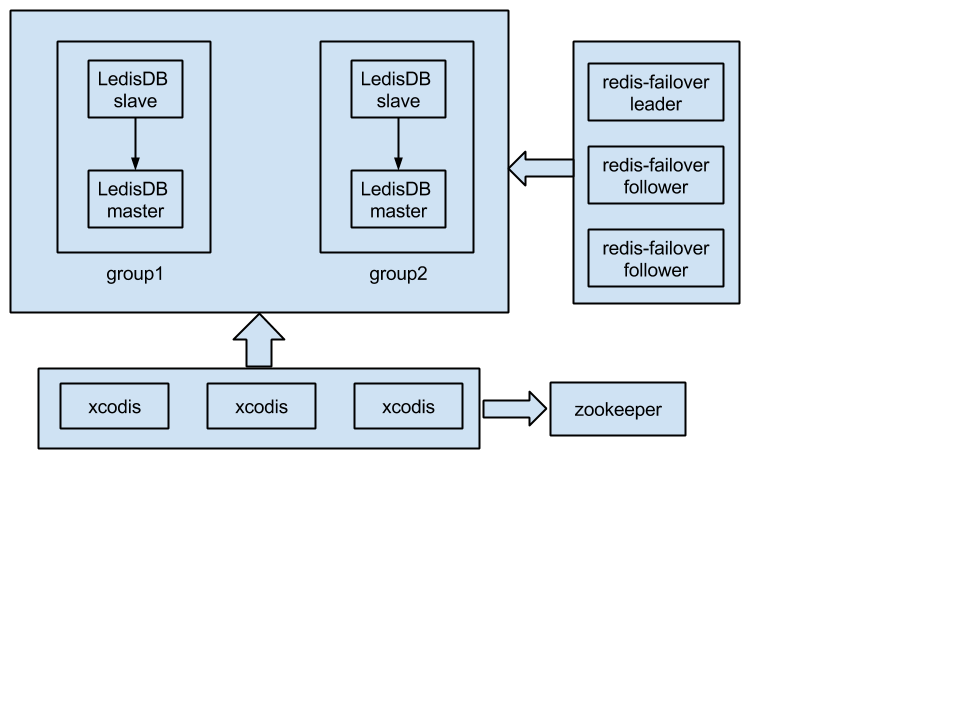

# Build up a High Availability Distributed Key-Value Store

## Preface

There are many awesome and powerful distributed NoSQL in the world, like Couchbase, MongoDB, Canssandra, etc. but developing a new one is still a challengeable, interesting and attractive thing for me, why?

+ It can satisfy our special needs for our cloud services.
+ We just need a key-value store, with some simple additional functionalities, we don’t need a complex solution.
+ We can control the whole thing, especially for fixing bugs and improvement.
+ Inventing the wheel is not good, but I can learn much in the process.

A key-value store may need below features:

+ Simple protocol.
+ Simple API.
+ High performance.
+ High availability.
+ Cluster support.

I knew this would be a hard journey first. But after a long hard work, I develop ledis-cluster, a key-value store based on [LedisDB][1] + [xcodis][2] + [redis-failover][3].

## Pre Solution Thinking

Before I develop ledis-cluster, I thought some other solutions which are valuable to be recorded here too.

### MySQL

Aha, first I just wanted to use MySQL as a key-value store. This thought amazed my colleagues before, and I think now it may surprise many other guys too.

MySQL is a relational database and can be used as a key-value store easily and sufficiently. We can use a simple table to store key value data like below:

```
CREATE TABLE kv (
    k varbinary(256),
    v blob,
    PRIMARY KEY(k),
) ENGINE=innodb;
```

When I worked in Tencent game infrastructure department, we used this way to serve many Tencent games and it works well.

But I don’t want to use MySQL as a key-value store now, MySQL is a little heavy and needs some experienced operations people, this is impossible for our team.

### Redis

Redis is an awesome NoSQL, it has an amazing performance, supports many useful data structures (kv, hash, list, set and zset), supplies a simple protocol for client user.

I have read the Redis’s code (it is very simple!) many times, used it for about three years in many productions, and I am absolutely confident of maintaining it.

But Redis has a serious problem: memory limitation. We can not store huge data in one machine. Using redis cluster is a good way to solve memory limitation, and there are many existing solutions, like official redis cluster, twemproxy or codis , but I still think another stuff saving huge data exceeding memory limitation in one machine is needed, so I develop LedisDB.

## LedisDB

LedisDB is a fast NoSQL, similar to Redis. It has some good features below:

+ Uses Redis protocol, most of the Redis clients can use LedisDB directly.
+ Supports multi data structures(kv, hash, list, set, zset).
+ Uses rocksdb, leveldb or other fast databases as the backend to store huge data, exceeding memory limitation.
+ High performance, see benchmark. Although it is a little slower than Redis, it can still be used in production.

A simple example:

```
//start ledis server
ledis-server
//another shell
ledis-cli -p 6380
ledis> set a 1
OK
ledis> get a
“1"
```

As we see, LedisDB is simple, we can switch to it easily if we used Redis before.

LedisDB now supports rocksdb, leveldb, goleveldb, boltdb and lmdb as the backend storage, we can choose the best one for our actual environment. In our company projects, we use rocksdb which has a awesome performance and many configurations to be tuned, and I will also use it for the following example.

## Data Security Guarantee

LedisDB can store huge data in one machine, so the data security needs to be considered cautiously. LedisDB uses below ways to guarantee it.

### Backup

We can back up LedisDB and then restore later. Redis saving RDB may block service for some time, but LedisDB doesn’t have this problem. Thanks to rocksdb fast generating snapshot technology, backing up LedisDB is very fast and easy.

### Binlog

LedisDB will first log write operations in binlog, then commit changes into backend storage, this is similar to MySQL.

Redis also has AOF, but the AOF file may grow largely, then rewriting AOF may also block service for some time. LedisDB will rotate binlog and write to the new one when current binlog is larger than maximum size (1GB).

### Replication

An old saying goes like this: “don’t put all your eggs in one basket”. Similarly, don’t put all our data in one machine.

LedisDB supports asynchronous or semi-synchronous replication. We can not break CAP(Consistency, Availability, Partition tolerance) theorem, for replication, partition tolerance must exist, so we have to choose between consistency and availability.

If we want to guarantee full data security, we may use semi-synchronous replication, but most of time, asynchronous replication is enough.

## Monitor and Failover

In the actual production environment, we use a master LedisDB and one or more slaves to construct the topology. We must monitor them in real time because any machine in the topology may be down at any time.

If a slave is down, we may not care too much, this is not a serious problem. But if the master is down (aha, a terrible accident!), we must resolve it quickly.

Generally, we can not expect the master to re-work quickly and infallibly, so electing a best new master from current slaves and doing failover is a better way when master is down.

Redis uses a sentinel feature to monitor the topology and do failover when the master is down. But this sentinel can not be used in LedisDB, so I develop another sentinel: redis-failover, monitoring and doing failover for Redis/LedisDB.

redis-failover uses `ROLE` command to check master and get all slaves every second. If the master is down, redis-failover will select the best slave from last `ROLE` returned slaves. The election algorithm is simple, using `INFO` command to get “slave_priority” and “slave_repl_offset” value, if a slave has a higher priority or a larger repliction offset with same priority, the slave will be elected as the new master.

redis-failover may have single point problem too, I use zookeeper or raft to support redis-failover cluster. Zookeeper or raft will elect a leader and let it monitor and do failover, if the leader is down, a new leader will be elected quickly.

## Cluster

Although LedisDB can store huge data, the growing data may still exceed the capability of the system in the near future.

Splitting data and storing them into multi machines may be the only feasible way(We don’t have money to buy a mainframe), but how to split the data? and how to find the data by a key? I think an easy solution is to define a key routing rule (mapping key to the actual machine).

For example, we have two machines, n0 and n1, and the key routing rule is simple hash like `crc32(key) % 2`. For key “abc”, the calculation result is 0, so we know that the corresponding data is in n0.

The above solution is easy, but we can not use it in production. If we add another machine, the machine number is 3, all the old data mapping relationship will be broken, and we have to relocate huge amount of data.

Using consistency hash may be better, but I prefer using hash + routing table. We don’t map a key to a machine directly, but to a virtual node named slot, then define a routing table mapping slot to the actual machine.

Continuing with the example, assume we use 1024 slots and 2 machines, the slot and machine mapping is [slot0 — slot511] -> n0, [slot512 — slot1023] -> n1. For a key, first using `crc32(key) % 1024` to get a slot index, then we can find the machine with this slot from the routing table.

This solution may be complex but have a big advantage for re-sharding. If we add another machine n2, change the routing table that mapping slot0 to n2, and we only need to migrate all slot0 data from n0 to n2. The bigger for slot number, the smaller for split data in a slot, and we only migrate little data for one slot.

xcodis uses above way to support LedisDB cluster. Now the slot number is 256, which is a little small that may increase the probability of mapping some busy keys into a slot.

Because of origin LedisDB db index implementation limitation, xcodis can not use bigger slot number than 256, so a better way is to support customizing a routing table for a busy key later. For example, for a key, xcodis should first try to find the associated slot in the routing table, if not found, then use hash.

Another radical choice is to change LedisDB code and upgrade all data saved before. This is may be a huge work, so I will not consider it unless I have no idea to resolve above problems.

xcodis is a proxy supporting redis/LedisDB cluster, the benefit of proxy is that we can hide all cluster information from client users and users can use it easily like using a single server.

In addition to proxy, there are also some other ways to support cluster too:

Official Redis cluster, but it is still in development and should not be used in production now, and it can not be used in LedisDB.
Customizing client SDK, the SDK can know whole cluster information and do the right key routing for the user. But this way is not universal and we must write many SDKs for different languages (c, java, php, go, etc.), a hard work!

## Final Architecture

At last, the final architecture may look below:



+ Use LedisDB to save huge data in one machine.
+ Use Master/slave to guarantee data security.
+ Use redis-failover to monitor the system and do failover.
+ Use xcodis to support cluster.

This architecture may be not perfect, but is simple and enough for us. Now we have only use LedisDB and xcodis in our projects, not the whole architecture, but we have been testing and will try to deploy it in production in the near future.

## Summary

Building up a key-value store is not a easy work, and I don’t think what I do above can beat other existing awesome NoSQLs, but it’s a valuable attempt, I have learned much and meet many new friends in the progress.

Now, I’am the only person to develop the whole thing and need help, if you have interested in what I do, please contact me, maybe we really can build up an awesome NoSQL. :-)

Mail: <siddontang@gmail.com>

Github: [github.com/siddontang](https://github.com/siddontang)

[1]: https://github.com/siddontang/ledisdb  "A Fast NoSQL"
[2]: https://github.com/siddontang/xcodis  "A distributed Redis/LedisDB proxy"
[3]: https://github.com/siddontang/redis-failover "Automatic redis monitoring and failover"
